# WebXR Scene Optimization

**TL;DR:** This mini-tutorial covers some simple methods of optimizing 3D assets for use in WebXR, especially for mobile VR and AR, using free tools like Blender. If you already have a decent handle on WHY your performance is bad and just want the tips, feel free to skip down to the [Finding the bottlenecks](#Finding-the-bottlenecks) section below.

## The Problem

If you are anything like me, your desire to create cool VR/AR content far outstrips your artistic abilities. (The code is willing but the mesh is weak, if you will.) If your project doesn't have a large team or budget backing it up that can create 3D scenes on demand it's natural to turn to the endless flood of creative talent that is the internet to find assets that can support your vision.

One of my favorite sources for 3D content is https://sketchfab.com. Besides being an excellent host for artist portfolios or social media embeds of 3D models, they also have a ton of content available both to purchase and to download for free under the Creative Commons license. PLUS, they have a tool that makes every downloadable asset on the site available as a [glTF 2.0 mesh](https://github.com/KhronosGroup/glTF/tree/master/specification/2.0). glTF is an extremely web-friendly format that imports painlessly into most of the popular rendering libraries and frameworks, so you can start seeing content on the screen in your page almost immediately! It's great!

(This, by the way, is EXACTLY how I made https://xrdinosaurs.com)

So, you find a model that you think would work great for what you have in mind. For me, I'll use this [adorable little fantasy island scene](https://sketchfab.com/3d-models/issum-the-town-on-capital-isle-e433923a64d549fabb2d30635d643ab6). It's low poly asthetic should work out well for the type of mobile-based XR platforms I want to support, like the Oculus Quest. Then you grab your favorite library and throw together a quick test page that loads up the model. For this walkthrough I'm going to use [Babylon.js](https://www.babylonjs.com/) because they have an extremely easy utility for adding VR support to your page with built-in teleporting functionality and I want to be able to jump around the island a bit. There's no reason that any other library you prefer won't work just as well, though.

[My first pass at the code is here.](./original/index.html) It's under 100 lines! Not a bad place to start!

[**You can visit the live version of the unoptimized page here.**](./original/index.html)

So maybe you fire that up on a desktop and it probably works well! Maybe you have a PC VR headset and give that a try and it's working well too! Hooray!

Then you try it on your target device. (I'm gonna use an Oculus Go just to really hammer the point home. It's a good device with nice WebXR support built in but a realtively weak processor.) And you notice that it's taking a long time to load, even on your local network. And when it finally does load, you click the VR button and...


(In case you were wondering, all that blackness at the edges is a sign that your content is running very poorly and your users is not having a good time.)

What gives? It's obviously a low poly scene with no fancy shaders or anything. You definitely feel like you've seen more detailed scenes on the same device before. Pls it's the only thing being rendered and it's completely static! You've barely started and your project is already failing!

Obviously the only logical conclusion is that WebXR sucks, Javascript sucks, Browsers suck, this whole Web thing was probably a mistake to begin with, and the only really viable way to make VR content is Unity. Right?

## The Reality

If we take a breath and take a step back, though, we'll see that there's a lot that we can do to improve performance, and none of it requires us to pull out John Carmack levels of GPU sorcery.

Here's the truth: Using WebGL for your rendering IS slower than doing the same thing with native code, but only in specific ways and if know what they are you can work on avoiding them.

When dealing with performance problems in 3D rendering, we can broadly place our bottlenecks into two categories: Fill Rate limited and Draw Call limited.

Fill Rate problems happen when your GPU simply can't keep up with the pixels you are asking it to draw. This typically happens because you've got a shader that's really complex or are drawing tons of polygons, especially if you've got things like lots of overlapping partially transparent geometry. Using lots of dynamic lights is also a quick way to eat up your GPU's processing power. When you're Fill Rate limited you generally want to try some combination of making your shaders less complicated, reducing how much you're drawing, reducing how many lights you're using, and reducing the resolution that you're rendering at. Basically anything that cuts down on how expensive it is to draw a pixel and how many of those pixels you're drawing.

Now the thing to realize about being Fill Rate limited is that whether you're using WebGL or some native engine, your GPU is still running things at the same speed. The web may introduce a small amount of overhead for compositing the page, but nothing about your GPU's processing power magically gets faster when using native code. Take [ShaderToy](https://www.shadertoy.com/), for example: NOTHING on that site is Draw Call limited, because everything is rendered using 2 triangles. You can still easily find shaders that make your GPU cry, but they wouldn't run any better if you draw the same shader using the most beautifully optimized native code in the world.

Where the web has a harder time relative to native code is when you're Draw Call limited, and sadly it's really easy to fall into that bucket. When you're Draw Call limited it's because your code can't feed commands to the GPU fast enough, and so your GPU is just sitting around waiting for you to tell it what to draw. This can be because your code is taking too long to make the draw calls (for example: you're waiting for physics code to finish before you start drawing), the calls you're making are really expensive (ie: Uploading large textures or vertex buffers every frame), or because you're making a lot of not-terribly-expensive calls that quickly add up. In my experience that last scenario is often the most likely.

Native code can be better at this part of things for a few reasons. There's newer graphics APIs available to native code (like Metal, Vulkan, and D3D12) that can tell the GPU what to draw more efficiently. This will be mitigated quite a bit when [WebGPU](https://gpuweb.github.io/gpuweb/) ships in the near-ish future, but in the meantime we've only got WebGL to work with, which is based on the pretty old OpenGL standard and is unfortunately verbose for a lot of common operations. Using features from WebGL 2.0 when possible is the best way to close the gap until then. (Libraries like Babylon.js will do this for you automatically.) Native code also has less overhead than JavaScript, so every function call in JavaScript tends to cost a little bit more, and native code tends to have better ways to parallelize work.

Despite all that, it's really easy to become Draw Call limited in BOTH web and native code, and the biggest difference is that the native engines, like Unity and Unreal, have more robust tools to help you fix it. There's no magic bullets to be had here, though, and most of the best performing native apps need to go through the same types of asset optimization that will benefit your web app.

So, with all that in mind and hopefully with a new-found confidence that your web content doesn't have to suck, let's take a look at what we can do to make things better for our little island scene.

## Finding the bottlenecks

As with anything in development, we shouldn't dive into optimizing anything until we've been able to measure the problem, so let's do some profiling! With any mobile device that uses a Chromium-based browser (that includes Oculus Go and Oculus Quest), you can pull up dev tools for pages running on your device from Chrome on your PC. Just plug your device in with a USB cable, make sure Development Mode is enabled (device specific but easily searchable), and navigate to **about:inspect** with Chrome on your PC. (I can't give you a direct link because Chrome requires you to enter it manually.) From there you should be able to see your mobile device listed as well as every tab open on the device. (You may need to accept a prompt to allow USB debugging on the device after ou open the page.) For me it looks like this:

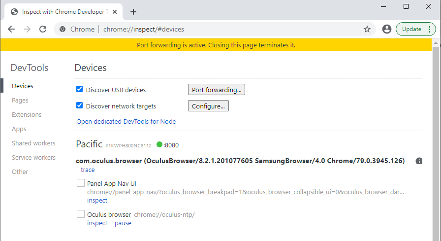

"Pacific" is the internal name for the Oculus Go, so that's the headset I'm trying to debug.

If you click on the "inspect" link for the tab you want to debug, you should see a (hopefully) familiar window, with all the dev tools you know and love now pointed at the tab on your mobile device.

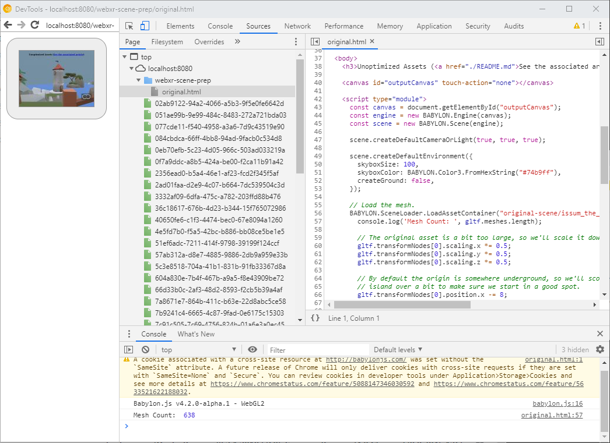

From here, we'll want to jump to the "Performance" tab and record a few seconds of profiling data to help give us an idea of where our frame time in being spent.


Make sure your page is already in VR or AR, then click the "Record" button and let it record a few seconds of data, ideally while wiggling your device around a bit so the data is slightly more "real world". When you stop it, you'll see a screen like this:

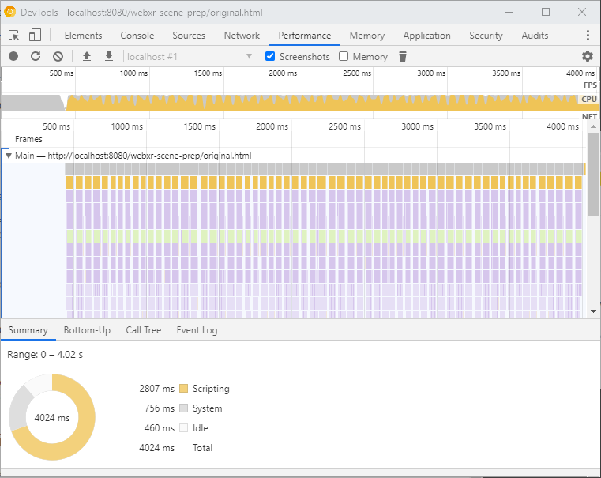

Use your mouse wheel to zoom in on the "Frames" graph in the middle till you can clearly make out the individual columns of function calls, like so:

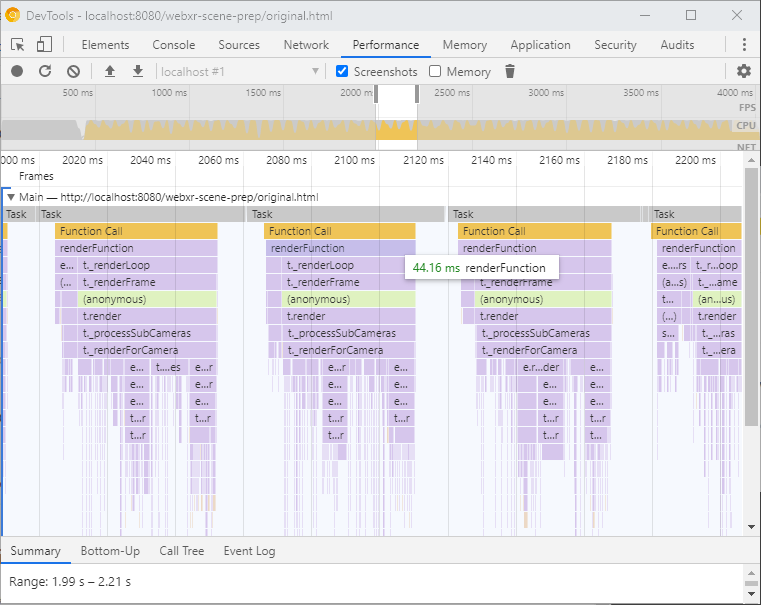

Each of those separate columns of calls (with the `Task` bar at the top) represents a single frame, and all the bars underneath it represent the call stack of functions made in that frame and how long each of them took respectively. At the top, just under the orange `Function Call` we can see a `renderFunction` bar. This, in my case, is the main call that Babylon.js is using to handle all the frame logic and thus represents how much time my page is spending running Javascript code each frame. If we mouse over it, we can see it's about 44ms per frame.

If we want to be running at the Oculus Go's ideal framerate of 72 FPS, we need that number to be under ~13ms. So, uh.... We're missing that. By a lot.


But! Now we know something very important: We're definitely Draw Call limited here. We're spending so much time in JavaScript telling the GPU what to draw that we can't fit it all into one frame. While we may still bum into Fill Rate limits later, we know that unless we reduce the amount of work our Javascript has to do, we can never hope to meet our frame budget.

## Reducing Draw Calls

One might expect that in order to reduce the amount of time we spend in JavaScript we need to optimize our code, but it's actually our 3D assets that are causing our JavaScript to take so long. Every rendering library you'll ever use does some variation of the following internal loop:

```js
for (let material of scene.materials) {
  // This includes setting which shaders and textures we'll use.
  SetupMaterialValuesInWebGL();

  for (let mesh of scene.meshesThatUseMaterial(material)) {
    // This includes setting which vertex buffers will be used.
    SetMeshValuesInWebGL();

    for (let instance of scene.instancesOfMesh(mesh)) {
      // Usually just position or color
      SetInstanceValues();

      Draw();
    }
  }
}
```

You can generally assume that setting up the material or mesh to be used is pretty expensive, while drawing individual instances (copies) of a mesh is relatively cheap (in Javascript, not necessarily on the GPU). So logically we can assume that if we reduce the number of materials or meshes we're using we can reduce the overall time spent in this loop.

So how many materials/meshes do we have now? Fortunately Babylon.js makes the list of meshes and materials easily accessible, so I can print their length to the console to find out:

```js
BABYLON.SceneLoader.LoadAssetContainer(contentPath, "scene.gltf", scene, function (gltf) {
  console.log('Material Count: ', gltf.materials.length);
  console.log('Mesh Count: ', gltf.meshes.length);
});
```

Which gives me:

```
Material Count:  49
Mesh Count:  638
```

If I go look at some of the performance recommendations for my target device ([detailed here](https://developer.oculus.com/documentation/unity/unity-perf/?locale=en_US)) the rough estimate is that I should only be submitting 50-100 draw calls per frame, and that's in a native environment. If we assume that each mesh is equal to _at least_ one draw call, uh.... We're over that. By a lot.

(See: "This is Fine" dog above. Maybe picture even more flames.)

## Into the Blender

So now we come to the portion of the tutorial where we break out a modeling tool. In my case I'm going to be using [Blender](https://www.blender.org/) because it's free, pretty powerful, and, as of version 2.8, reasonably easy to use. It also has very nice glTF import/export support! If you have a different tool you're comfortable with of course feel free to use it. If you're not familiar with any 3D modeling tools then give Blender a try, but take a moment to [learn how to navigate the viewport](https://docs.blender.org/manual/en/latest/editors/3dview/navigate/navigation.html) first before reading further.

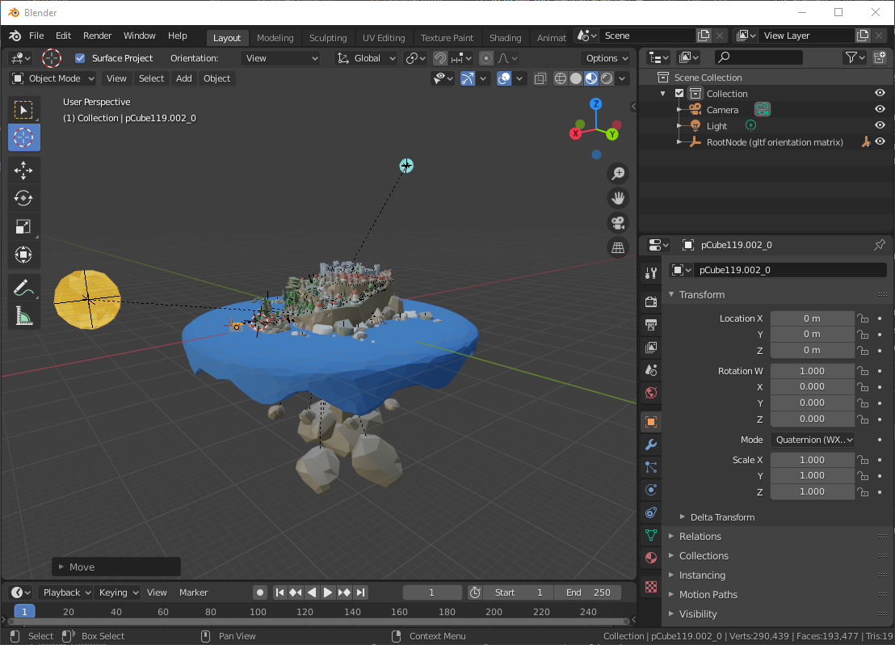

The first thing we want to do is try and find any meshes that the user won't be able to see and get rid of them. No sense in spending time rendering that's never shown, right? You need to take into account where you expect the user to be able to move, which in my case is all over the top of the island. However just by looking at the zoomed out view here I can see that there's a bunch of rock formations under the island that look cool if you're viewing the island as a table-like diorama, but won't do anything for my experience where the user stays on the island itself. So the very first thing I'm going to do is get rid of those.

I can do this in Blender's "Object Mode" by selecting all the rocks (Shift+Click to add to your selection) and then hit "Delete" or "X".

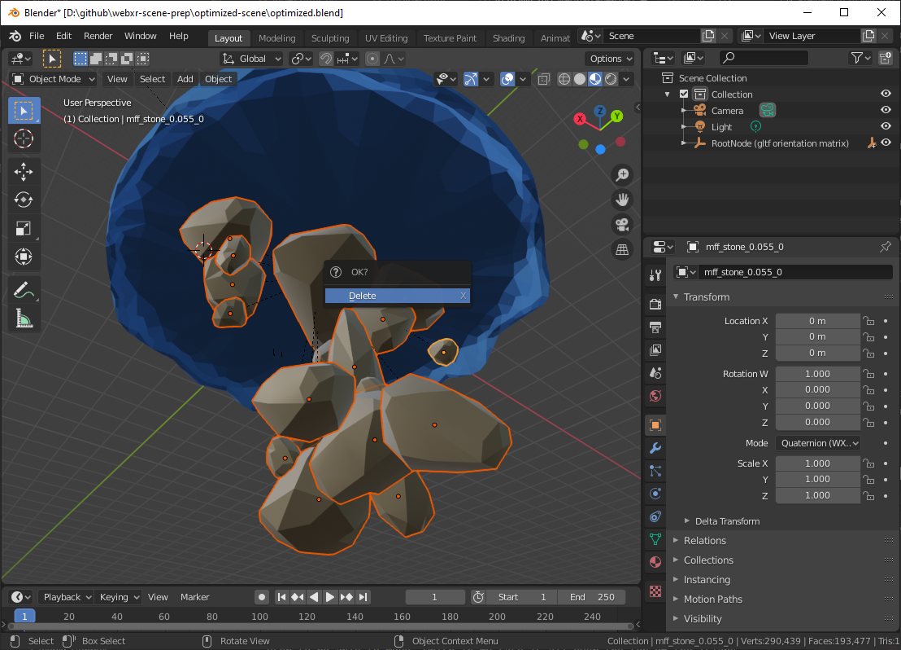

I delete a few other items as well as I spin around the island, mostly very small meshes in out of the way places where I don't thing the player will ever notice even if they technically can see it. So that takes care of the obvious meshes I can get rid of without hurting the asthetic that drew me to this scene in the first place. Let's see how we did!

```
Mesh Count:  638 -> 614
```

Hrm... not a terribly impressive reduction. But fear not! We have a much more powerful trick up our sleeve.

## Merging by Material

If you look around the island, you'll see that there's a LOT of objects that share the same material (texture/color/shinyness/etc.), even if they don't have the same shape. Let's look at the towers of the castle for example.

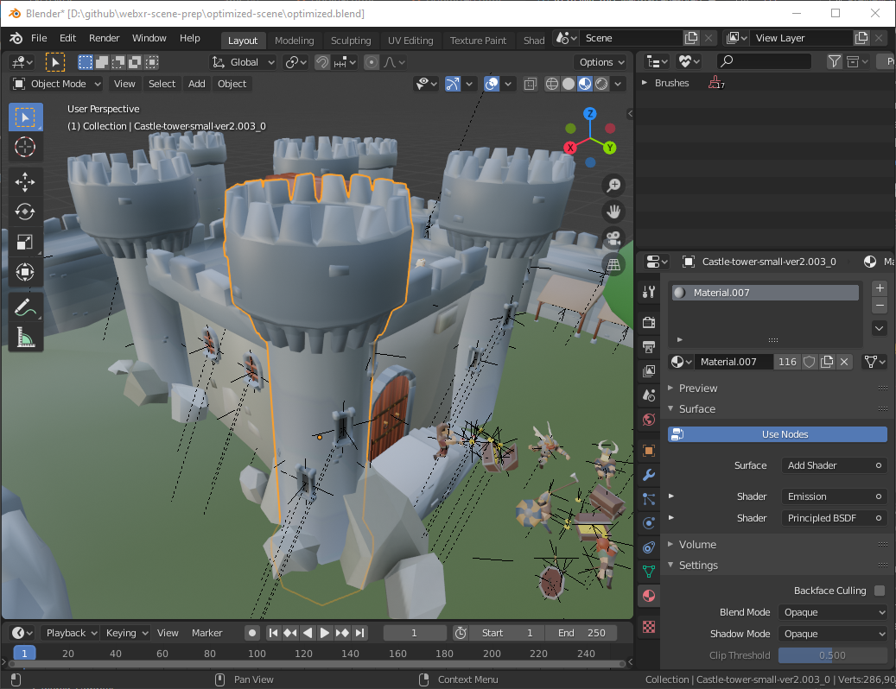

You'll notice in the right hand pane I've got the "materials" tab open and it shows that this tower is using the descriptively names "Material.007". Furthermore, next to it is a number that shows how many other meshes in the scene are using the same material. 116! If we click around the scene to see other objects with the same material we'll find it's used on the castle walls, bridges, houses, even the sheep! It's pretty common for artists to reuse their materials multipled times throughout a scene simply because it's often easier on them to do it that way.

When materials do get reused across multiple meshes, we can still apply a really easy trick: Merging most/all of the meshes using a single material into one big mesh!

Blender makes this particularly easy on us: In "Object Mode" select any mesh using the shared material, then click the "Select" menu -> "Select Linked" -> "Material", and now every mesh in the scene that uses the same material will be selected!

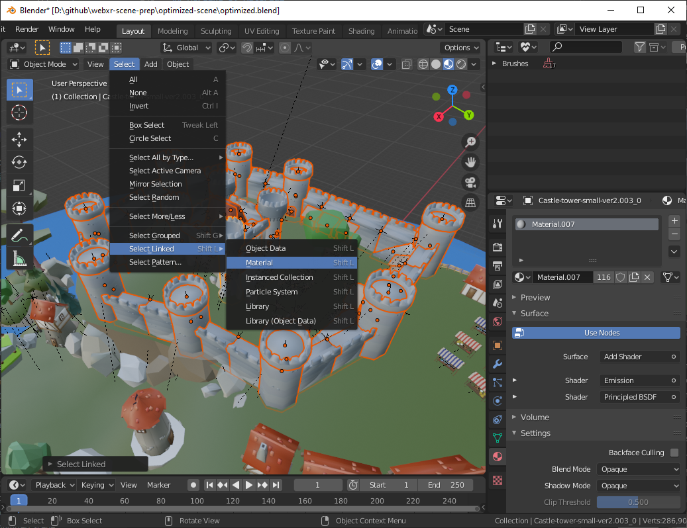

Then we can join them together into one big mesh by clicking the "Object" menu -> "Join".

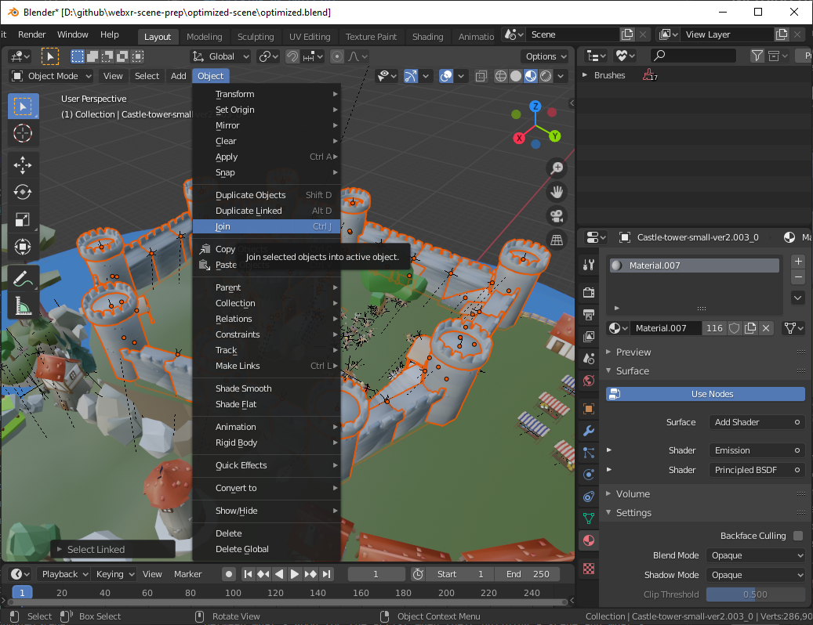

And presto! We've now removed 115 draw calls from our rendering loop!

There's a lot of other opportunities for the same thing in this scene. Houses, fences, people, stones, etc all were re-used by the artist all over the island, so I've happily gone through and merged most of the meshes that I can. The "Outliner" view in the upper right corner is really helpful for this. Any Triangle icon you see is a mesh, so you can just spin through the list and find any meshe with shared materials.

And the reward for my efforts?

```
Mesh Count:  614 -> 53
```

Now THAT'S a big improvement! Let's see how it performs in the headset.


Woo! SO much better! We still get some black borders if we're whipping our head around fast, but more typical movements look just fine and even the quick movements don't look bad when you're actually in the headset. Happily our profiling tools show the same level of improvement.

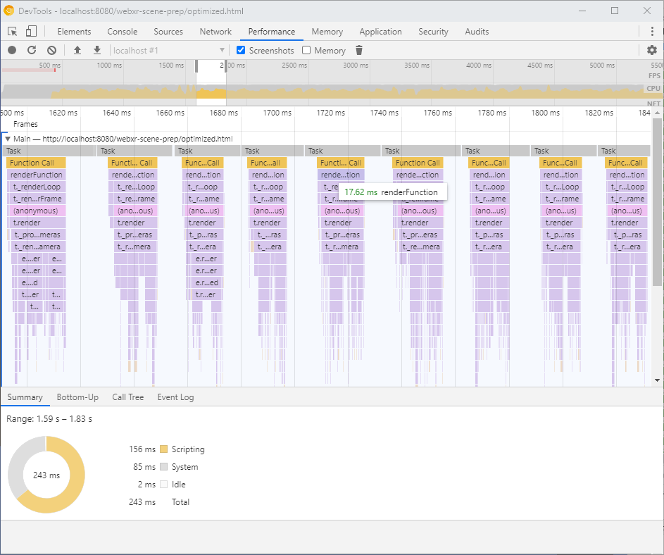

We're still not down to the ideal ~13ms frame time, but this is immensely better and actually feels pretty decent thanks to the hardware's reprojection capabilities.

## When not to Merge

That was such a huge boost in the performance of our scene, you may wonder why it's not a standard part of model building to smoosh all your meshes into one big triangle ball all the time. But, as it turns out, there's a bunch of good reasons why you may want to leave meshes separated, even when they share the same material.

First and foremost is if you're still editing the scene. Merged meshes are great for rendering but a major pain for mesh placement. For example, if, after merging, we try to move just one of the rocks on the island we'll find that almost every other rock on the island now wants to move at the same time. We can still move single features if we're willing to go into "Edit Mode" and select all the faces individually (a time consuming task), but it's much easier to change the layout when everything is still separate. As such the mesh merging should usually be done as a last step, and it's a good idea to keep an un-merged copy of the asset around in case you need to edit it later. There tends to be a natural tension between what's good for the artist when their building a scene and what's good for realtime rendering, and this is definitely one of those cases.

For mostly the same reasons, if you have individual meshes that you want to move around at runtime, you should leave them separate as well. For instance: There's various birds around the island, and if I wanted to have them fly around on some preset path it's easiest to leave them separate so I can either keyframe the animation in Blender or do it programatically in my page script.

I also found that in the process of doing the merge I accidentally stomped on the meshes that I was using in the unoptimized version for teleportation. (The `floorMeshes` that you pass to Babylon's `createDefaultXRExperience` method.) This turned out to be a happy accident, though, as it forced me to pick out only the individual triangles I wanted to be able to "walk" on in the mesh (done in "Edit Mode") and split them out into a separate mesh ("Mesh" menu -> "Separate" -> "Selection").

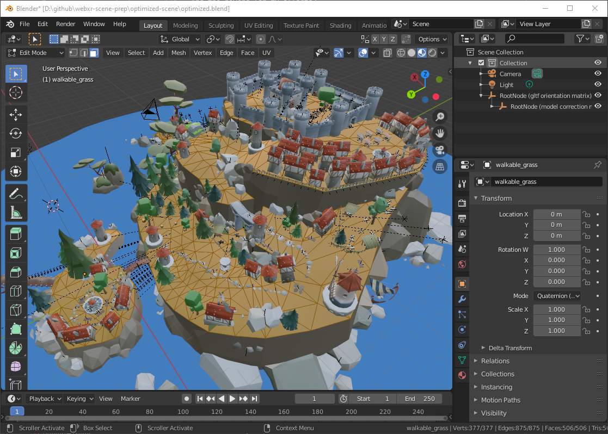

Finally, depending on your scene and how your rendering library works, it can be useful to limit the mesh merging to more closely grouped meshes to aid in frustum culling and/or occlusion culling. Frustum culling is when the rendering library is able to easily determine that a given mesh won't be visible because it's outside the field of view of the camera, and as such doesn't need to be submitted for rendering at all. The problem is that if, for example, every house on the island is part of the same mesh some portion of that mesh (or, more likely, it's bounding box) is pretty much always visible, and as such every house is drawn every frame even if it's completely behind the camera.

Now, the GPU still does a lot of internal tricks to figure out those triangles aren't visible very early on and discard them, so this isn't the end of the world, and unless you're seeing that your page is Fill Rate limited (roughly speaking, when the amount of time spend in JavaScript is under the frame budget but you're still rendering too slow) it may not be worth it to introduce more potential draw calls for the purposes of allowing better culling. This is a case-by-case thing, and you should pay attention to your own page's performance characteristics to determine how to proceed.

## Reducing the number of materials

While on my merge-a-palooza I also noticed that there were a couple of textures that shipped with the model that happened to be identical. Browsing through the materials in Blender, I found that they were being used in effectively identical materials (same roughness, blending behavior, etc.) but happened to be applied to different meshes. For example: The little Golem on one end of the island shared an identical material with some tree stumps, but both materials were using a different copy of the same texture. This is a little weird, and I don't expect it to be a common problem that you'd see in most meshes. It's probably just a side effect of how the mesh was authored and exported/imported. In any case, I was able to set both sets of meshes to use a single material, which then let me merge them.

Another common way of reducing the number of materials used is to use Texture Atlases, though it's a method that takes a bit more manual work than some other optimizations. A Texture Atlas is simply combining several textures into one larger one. Depending on the scene and how aggressively you're optimizing it you can either batch a few textures from similar objects into one or entire scene's worth of textures into one big atlas. For this scene I opted for just atlasing a few textures for similar objects. For example: I noticed that there were some stone circles that were always paired with bases that used a stone wall texture, so I combined those two textures into one:

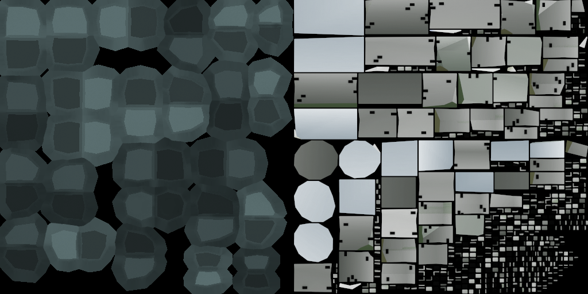

Then, in blender, I changed the material for one of the mesheses to use the atlas texture, and assigned that material to the other mesh as well. The final step then is that you have to adjust the texture coordinates for each set of meshes to cover only their portion of the atlas, which you can see me doing here:


And of course, once the meshes are sharing a material they're good candiates for merging!

In the end I didn't get too much of a mesh reduction out of these two techniques, but that's mostly because we'd already done most of the agressive mesh reduction in the original merge pass. Still, every reduction helps when you're talking about mobile hardware.

```
Mesh Count:  53 -> 45
```

## Improving load times

At this point I think I'm going to stop optimizing for draw call count, because we're doing OK on that front. The Oculus Go I've been testing with primarily is still a bit jumpy depending on the angle you look at the island from, but it's a tolerable experience now, as opposed to being completely unusable when we started. And when you bump up to more powerful hardware like the Oculus Quest it feels really good!

However, we're still dealing with long load times for the page, which is mostly due to our fairly large (for the web) assets. If we're exporting to a separate .gltf/bin/textures we can see the breakdown looks something like this:

```
.gltf:    133KB
.bin:     10.6MB
textures: 6.63MB
----------------
Total:    17.3MB
```

Let's see what we can do about that so that our users can start seeing our content faster!

## Mesh size optimization

The .bin file contains all of our mesh data, so things like vertex positions and triangle layouts. This may seem difficult to reduce the size of without removing details from our scene, but fortunately we have some excellent tools to help us out!

I cannot recommend (glTF-Pipeline)[https://github.com/CesiumGS/gltf-pipeline] highly enough for things like this. It's an excellent and easy to use tool that makes a big, meaningful difference in your 3D assets. Follow the instructions on that page to learn how to install and use it, but I'll cover the highlights here:

First off, while it doesn't directly affect the total file size, it's helpful to package our separate .gltf/bin/texture files up into a single binary glTF file (.glb). This helps streamline the download a bit by getting rid of some HTTP overhead for each file.

```
gltf-pipeline -i scene.gltf -o scene.glb
```

For what it's worth, Blender will export to a .glb directly as well, but in some cases it can be good to be able to inspect what Blender's outputting more directly, so the separate files can be nice during development.

Now we can pull out the big guns: [Draco Compression](https://google.github.io/draco/). This compression library takes our vertex data and crunches it down losslessly to a fraction of it's original size.

```
gltf-pipeline -i scene.gltf -o scene.glb
```

## Image optimization

If you've been doing much work on the web in the past you may be familiar with some of the tricks of the trade when it comes to image size reduction, and they pretty much all apply here.

First thing to look for is any images that just seem too big for their intended purpose. For example, there's a lot of textures packed in with this scene that are effectively just blotches of solid color, like this:

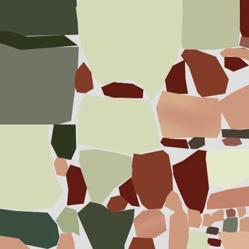

That image is 512x512 px, and it just really doesn't need to be. We can easily scale it down to a quarter that size (256x256) and not lose anything important.


[**See the live version of the optimized page here.**](./optimized/index.html)